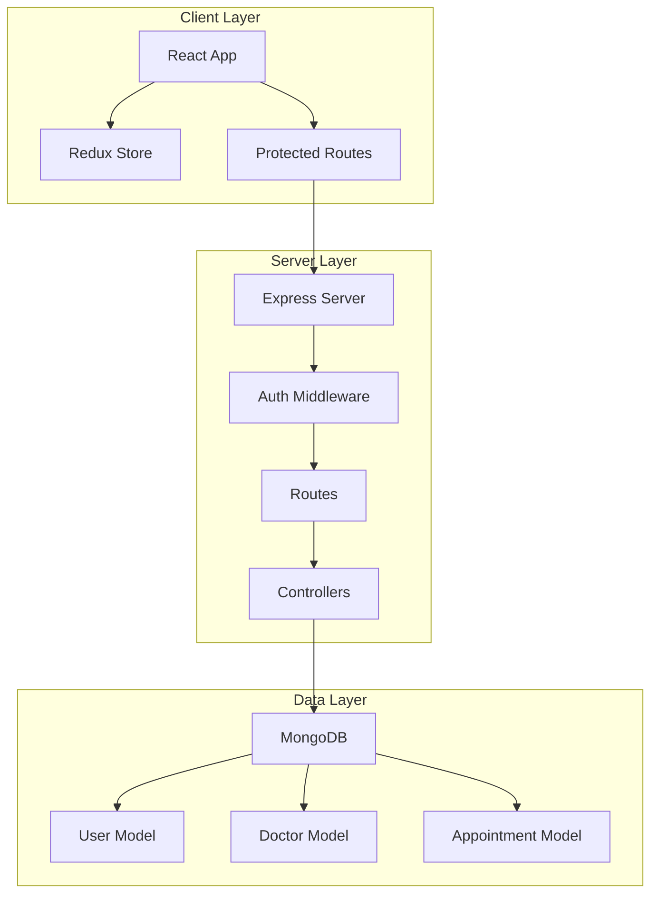
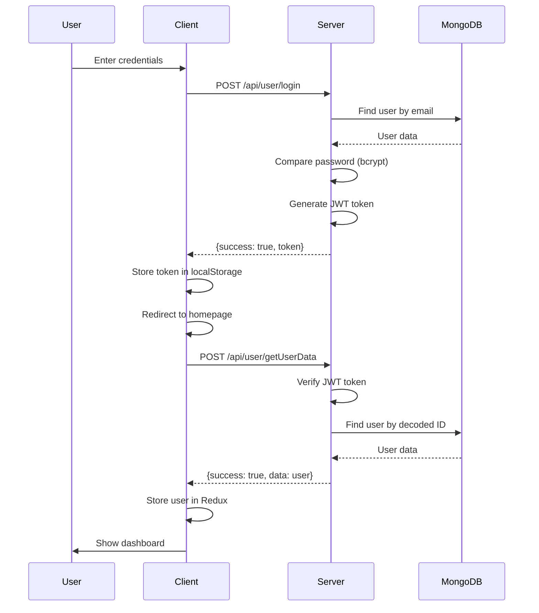
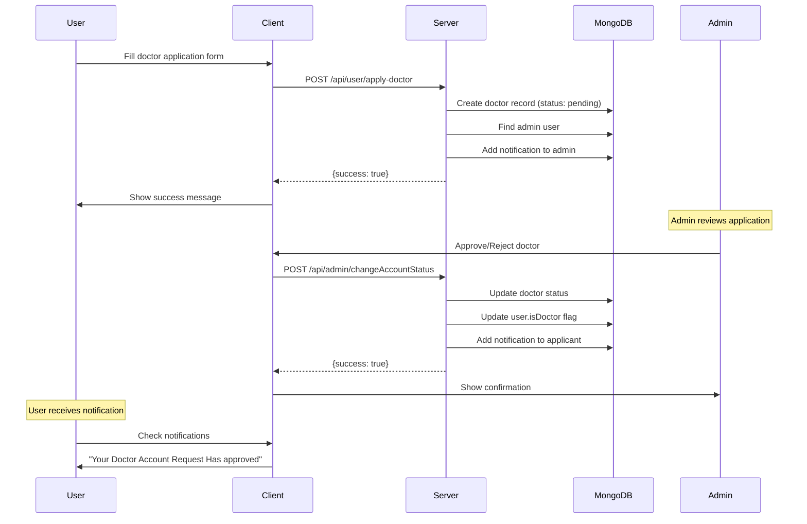
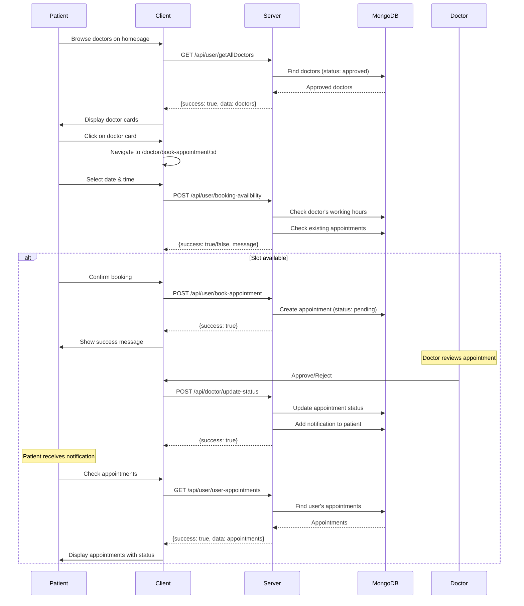

# Doctor-Appointment System - Architecture & Flow Analysis

## 📋 Project Overview

**AppointDoc** is a full-stack MERN (MongoDB, Express, React, Node.js) application for managing doctor appointments. The system supports three distinct user roles with different capabilities and workflows.

### Tech Stack

**Backend:**

- Node.js + Express.js (REST API)
- MongoDB + Mongoose (Database & ODM)
- JWT (Authentication)
- Bcrypt (Password hashing)
- Joi (Validation)
- Moment.js (Date/time handling)

**Frontend:**

- React 18 (UI framework)
- Redux Toolkit (State management)
- React Router v6 (Client-side routing)
- Ant Design (UI components)
- Axios (HTTP client)
- Bootstrap (Additional styling)

---

## 🏗️ System Architecture

### High-Level Architecture



---

## 🗄️ Backend Architecture

### 1. Database Models

#### User Model ([userModel.js](file:///c:/Users/Sidd/Desktop/Projects/Doctor-Appointment/models/userModel.js))

Stores all user accounts (patients, doctors, admins).

**Key Fields:**

- `name` - User's full name (2-50 chars)
- `email` - Unique email address
- `password` - Hashed password with strength validation (zxcvbn score ≥ 3)
- `isAdmin` - Boolean flag for admin role
- `isDoctor` - Boolean flag for doctor role
- `notification[]` - Array of unread notifications
- `seennotification[]` - Array of read notifications

**Validation:**

- Password must contain: uppercase, lowercase, number, special character
- Joi schema validation for input
- Mongoose schema validation for database

#### Doctor Model ([doctorModel.js](file:///c:/Users/Sidd/Desktop/Projects/Doctor-Appointment/models/doctorModel.js))

Stores doctor profiles and availability.

**Key Fields:**

- `userId` - Reference to User model
- `firstName`, `lastName` - Doctor's name
- `phone`, `email`, `website`, `address` - Contact info
- `specialization` - Medical specialty
- `experience` - Years of experience
- `feesPerConsultation` - Consultation fee
- `status` - Approval status: "pending" | "approved" | "rejected"
- `starttime`, `endtime` - Daily availability window

#### Appointment Model ([appointmentModel.js](file:///c:/Users/Sidd/Desktop/Projects/Doctor-Appointment/models/appointmentModel.js))

Stores appointment bookings.

**Key Fields:**

- `userId` - Patient's user ID
- `doctorId` - Doctor's ID
- `doctorInfo` - Stringified doctor details
- `userInfo` - Stringified patient details
- `date` - Appointment date
- `time` - Appointment time
- `status` - "pending" | "approved" | "rejected"

---

### 2. API Routes & Controllers

#### User Routes ([userRoute.js](file:///c:/Users/Sidd/Desktop/Projects/Doctor-Appointment/routes/userRoute.js))

| Method | Endpoint                            | Auth | Controller                        | Purpose                      |
| ------ | ----------------------------------- | ---- | --------------------------------- | ---------------------------- |
| POST   | `/api/user/login`                   | ❌   | `loginController`                 | User login                   |
| POST   | `/api/user/register`                | ❌   | `registerController`              | User registration            |
| POST   | `/api/user/getUserData`             | ✅   | `authController`                  | Get authenticated user data  |
| POST   | `/api/user/apply-doctor`            | ✅   | `applyDoctorController`           | Apply for doctor account     |
| POST   | `/api/user/get-all-notification`    | ✅   | `getAllNotificationController`    | Mark notifications as read   |
| POST   | `/api/user/delete-all-notification` | ✅   | `deleteAllNotificationController` | Clear all notifications      |
| GET    | `/api/user/getAllDoctors`           | ✅   | `getAllDocotrsController`         | Get approved doctors         |
| POST   | `/api/user/book-appointment`        | ✅   | `bookAppointmentController`       | Book appointment             |
| POST   | `/api/user/booking-availbility`     | ✅   | `bookingAvailabilityController`   | Check time slot availability |
| GET    | `/api/user/user-appointments`       | ✅   | `userAppointmentsController`      | Get user's appointments      |

#### Admin Routes ([adminRoute.js](file:///c:/Users/Sidd/Desktop/Projects/Doctor-Appointment/routes/adminRoute.js))

| Method | Endpoint                         | Auth | Controller                      | Purpose                            |
| ------ | -------------------------------- | ---- | ------------------------------- | ---------------------------------- |
| GET    | `/api/admin/getAllUsers`         | ✅   | `getAllUsersController`         | Get all users                      |
| GET    | `/api/admin/getAllDoctors`       | ✅   | `getAllDoctorsController`       | Get all doctors (any status)       |
| POST   | `/api/admin/changeAccountStatus` | ✅   | `changeAccountStatusController` | Approve/reject doctor applications |

#### Doctor Routes ([doctorRoute.js](file:///c:/Users/Sidd/Desktop/Projects/Doctor-Appointment/routes/doctorRoute.js))

| Method | Endpoint                          | Auth | Controller                     | Purpose                     |
| ------ | --------------------------------- | ---- | ------------------------------ | --------------------------- |
| POST   | `/api/doctor/getDoctorInfo`       | ✅   | `getDoctorInfoController`      | Get doctor's profile        |
| POST   | `/api/doctor/updateProfile`       | ✅   | `updateProfileController`      | Update doctor profile       |
| POST   | `/api/doctor/getDoctorById`       | ✅   | `getDoctorByIdController`      | Get specific doctor details |
| GET    | `/api/doctor/doctor-appointments` | ✅   | `doctorAppointmentsController` | Get doctor's appointments   |
| POST   | `/api/doctor/update-status`       | ✅   | `updateStatusController`       | Approve/reject appointments |

---

### 3. Authentication & Middleware

#### Auth Middleware ([authMiddleware.js](file:///c:/Users/Sidd/Desktop/Projects/Doctor-Appointment/middlewares/authMiddleware.js))

**Flow:**

1. Extracts JWT token from `Authorization` header (Bearer token)
2. Verifies token using `JWT_SECRET`
3. Decodes user ID and attaches to `req.body.userId`
4. Proceeds to controller or returns 401 error

**Usage:** Applied to all protected routes

#### Database Connection ([connectDb.js](file:///c:/Users/Sidd/Desktop/Projects/Doctor-Appointment/config/connectDb.js))

- Connects to MongoDB Atlas using `DB_URL` from environment variables
- Uses Mongoose with `useNewUrlParser` and `useUnifiedTopology`
- Exits process on connection failure

---

## 🎨 Frontend Architecture

### 1. Application Structure

```
client/src/
├── components/          # Reusable components
│   ├── Layout.js       # Main layout with sidebar & header
│   ├── ProtectedRoute.js  # Route guard for authenticated users
│   ├── PublicRoute.js  # Route guard for unauthenticated users
│   ├── DoctorList.js   # Doctor card component
│   └── Spinner.js      # Loading spinner
├── pages/              # Page components
│   ├── HomePage.js     # Dashboard with doctor list
│   ├── Login.js        # Login page
│   ├── Register.js     # Registration page
│   ├── ApplyDoctor.js  # Doctor application form
│   ├── Appointments.js # User appointments list
│   ├── BookingPage.js  # Appointment booking form
│   ├── NotificationPage.js  # Notifications center
│   ├── admin/
│   │   ├── Users.js    # Admin: user management
│   │   └── Doctors.js  # Admin: doctor management
│   └── doctor/
│       ├── Profile.js  # Doctor profile editor
│       └── DoctorAppointments.js  # Doctor appointments
├── redux/
│   ├── store.js        # Redux store configuration
│   └── features/
│       ├── alertSlice.js  # Loading & notification state
│       └── userSlice.js   # User data state
└── Data/
    └── data.js         # Menu configurations
```

---

### 2. Routing System ([App.js](file:///c:/Users/Sidd/Desktop/Projects/Doctor-Appointment/client/src/App.js))

**Route Protection:**

- `<ProtectedRoute>` - Requires authentication (JWT token in localStorage)
- `<PublicRoute>` - Only accessible when not authenticated

**Route Map:**

| Path                                 | Component          | Access             | Description                     |
| ------------------------------------ | ------------------ | ------------------ | ------------------------------- |
| `/`                                  | HomePage           | Protected          | Dashboard with approved doctors |
| `/login`                             | Login              | Public             | Login form                      |
| `/register`                          | Register           | Public             | Registration form               |
| `/apply-doctor`                      | ApplyDoctor        | Protected          | Doctor application              |
| `/appointments`                      | Appointments       | Protected          | User's appointments             |
| `/doctor/book-appointment/:doctorId` | BookingPage        | Protected          | Book appointment                |
| `/notification`                      | NotificationPage   | Protected          | Notifications center            |
| `/admin/users`                       | Users              | Protected (Admin)  | User management                 |
| `/admin/doctors`                     | Doctors            | Protected (Admin)  | Doctor management               |
| `/doctor/profile/:id`                | Profile            | Protected (Doctor) | Doctor profile                  |
| `/doctor-appointments`               | DoctorAppointments | Protected (Doctor) | Doctor's appointments           |

---

### 3. State Management (Redux)

#### Alert Slice ([alertSlice.js](file:///c:/Users/Sidd/Desktop/Projects/Doctor-Appointment/client/src/redux/features/alertSlice.js))

**State:**

```javascript
{
  loading: boolean,
  user: {
    notification: [],
    seennotification: []
  }
}
```

**Actions:**

- `showLoading()` - Display loading spinner
- `hideLoading()` - Hide loading spinner
- `setUserNotification(payload)` - Update notifications
- `setSeenNotification(payload)` - Update seen notifications

#### User Slice ([userSlice.js](file:///c:/Users/Sidd/Desktop/Projects/Doctor-Appointment/client/src/redux/features/userSlice.js))

**State:**

```javascript
{
  user: null | UserObject;
}
```

**Actions:**

- `setUser(payload)` - Set authenticated user data

---

### 4. Key Components

#### Layout Component ([Layout.js](file:///c:/Users/Sidd/Desktop/Projects/Doctor-Appointment/client/src/components/Layout.js))

**Features:**

- **Dynamic Sidebar:** Menu changes based on user role (User/Doctor/Admin)
- **Notification Badge:** Shows unread notification count
- **User Header:** Displays logged-in user's name
- **Logout Functionality:** Clears localStorage and redirects to login

**Menu Configurations:**

- **User Menu:** Home, Appointments, Apply Doctor
- **Doctor Menu:** Home, Appointments, Profile
- **Admin Menu:** Home, Doctors, Users

#### Protected Route ([ProtectedRoute.js](file:///c:/Users/Sidd/Desktop/Projects/Doctor-Appointment/client/src/components/ProtectedRoute.js))

**Flow:**

1. Checks for JWT token in localStorage
2. If no token → Redirect to `/login`
3. If token exists but no user in Redux:
   - Calls `/api/user/getUserData` with token
   - Stores user data in Redux
   - Shows loading spinner during fetch
4. Renders children components when authenticated

---

## 🔄 Application Flows

### Authentication Flow



---

### Doctor Application Flow



---

### Appointment Booking Flow



---

### Notification System Flow

**Notification Triggers:**

1. **Doctor Application:**
   - Admin receives: "Dr. [Name] Has Applied For A Doctor Account"

2. **Application Status Change:**
   - Applicant receives: "Your Doctor Account Request Has [approved/rejected]"

3. **Appointment Status Change:**
   - Patient receives: "Your Appointment Has Been Updated [approved/rejected]"

**Notification Management:**

```mermaid
graph LR
    A[New Notification] --> B[notification array]
    B --> C[User clicks bell icon]
    C --> D[POST /get-all-notification]
    D --> E[Move to seennotification]
    E --> F[Clear notification array]
    F --> G[Display in NotificationPage]
    G --> H[User clicks Delete All]
    H --> I[POST /delete-all-notification]
    I --> J[Clear both arrays]
```



---

## 👥 User Roles & Permissions

### 1. Regular User (Patient)

**Capabilities:**

- ✅ Register and login
- ✅ Browse approved doctors
- ✅ Book appointments
- ✅ View own appointments
- ✅ Apply to become a doctor
- ✅ Receive notifications

**Restrictions:**

- ❌ Cannot access admin pages
- ❌ Cannot access doctor profile pages
- ❌ Cannot approve/reject appointments

---

### 2. Doctor

**Capabilities:**

- ✅ All user capabilities
- ✅ View and edit own profile
- ✅ Update availability (start/end time)
- ✅ View appointments booked with them
- ✅ Approve/reject appointments
- ✅ Update consultation fees

**Restrictions:**

- ❌ Cannot access admin pages
- ❌ Cannot modify other doctors' profiles

**Becomes Doctor When:**

- Admin approves their doctor application
- `user.isDoctor` flag set to `true`
- `doctor.status` set to `"approved"`

---

### 3. Admin

**Capabilities:**

- ✅ View all users
- ✅ View all doctors (any status)
- ✅ Approve/reject doctor applications
- ✅ Change doctor account status

**Restrictions:**

- ❌ Cannot book appointments (admin-only role)
- ❌ Cannot apply as doctor

**Admin Account:**

- Must be manually set in database (`isAdmin: true`)
- No registration flow for admin

---

## 🔐 Security Features

1. **Password Security:**
   - Bcrypt hashing with 10 salt rounds
   - Password strength validation (zxcvbn score ≥ 3)
   - Must contain: uppercase, lowercase, number, special character

2. **JWT Authentication:**
   - Token expires in 1 day
   - Stored in localStorage
   - Sent in Authorization header: `Bearer <token>`
   - Verified on every protected route

3. **Route Protection:**
   - Client-side: `ProtectedRoute` component
   - Server-side: `authMiddleware` on all protected endpoints

4. **Input Validation:**
   - Joi schemas for request validation
   - Mongoose schemas for database validation
   - Email uniqueness enforced

---

## 📊 Data Flow Summary

### Client → Server Communication

**Request Pattern:**

```javascript
axios.get /
  post(endpoint, data, {
    headers: {
      Authorization: `Bearer ${localStorage.getItem("token")}`,
    },
  });
```

**Response Pattern:**

```javascript
{
  success: boolean,
  message: string,
  data?: any,
  error?: any
}
```

### State Management Pattern

1. **Loading State:**

   ```javascript
   dispatch(showLoading());
   // API call
   dispatch(hideLoading());
   ```

2. **User State:**

   ```javascript
   // On login/auth
   dispatch(setUser(userData));

   // Access in components
   const { user } = useSelector((state) => state.user);
   ```

---

## 🚀 Application Startup

### Backend ([index.js](file:///c:/Users/Sidd/Desktop/Projects/Doctor-Appointment/index.js))

1. Load environment variables (`.env`)
2. Connect to MongoDB
3. Initialize Express app
4. Apply middleware (JSON parser, Morgan logger)
5. Register routes:
   - `/api/user/*` → User routes
   - `/api/admin/*` → Admin routes
   - `/api/doctor/*` → Doctor routes
6. Serve static files from `client/build`
7. Catch-all route for React SPA
8. Listen on port 4000

### Frontend

1. React app proxies API calls to `http://localhost:4000`
2. Redux store initialized with alert & user slices
3. Router checks authentication on every route
4. Protected routes fetch user data if not in Redux
5. Layout component renders role-based sidebar

---

## 🔧 Environment Configuration

**Required Variables (`.env`):**

```env
DB_URL=mongodb+srv://<user>:<pass>@cluster0.ibsbbii.mongodb.net/?appName=Cluster0
JWT_SECRET=b4b27aee18e9e16e27a9bcaaef5b1b71
PORT=4000
```

---

## 📝 Key Business Logic

### Appointment Availability Check

**Validation Steps:**

1. Verify doctor exists
2. Check if requested time is within doctor's working hours (`starttime` - `endtime`)
3. Check if slot is already booked for that date/time
4. Ensure appointment status is "approved" when checking conflicts

### Doctor Approval Process

**Steps:**

1. User submits doctor application
2. Doctor record created with `status: "pending"`
3. Admin notification created
4. Admin reviews and changes status to "approved" or "rejected"
5. User's `isDoctor` flag updated accordingly
6. User receives notification of decision

### Notification System

**Storage:**

- Notifications stored in user document
- Two arrays: `notification` (unread) and `seennotification` (read)

**Workflow:**

1. New notification added to `notification[]`
2. User clicks "Mark All as Read"
3. All items moved from `notification[]` to `seennotification[]`
4. User can delete all notifications (clears both arrays)

---

## 🎯 Summary

This Doctor-Appointment system is a well-structured MERN application with:

- **Clear separation of concerns:** Models, routes, controllers on backend; components, pages, state on frontend
- **Role-based access control:** Three distinct user types with different permissions
- **Secure authentication:** JWT tokens with password hashing and validation
- **Real-time notifications:** In-app notification system for status updates
- **Appointment management:** Complete booking workflow with availability checking
- **Responsive UI:** Ant Design components with custom styling
- **State management:** Redux Toolkit for global state
- **Protected routing:** Client and server-side authentication guards

The architecture follows MERN best practices with modular code organization, making it maintainable and scalable.
